

# COPIAS DE SEGURIDAD CIFRADAS - DUPLICATI

***Nombre:*** Nahuel Ivan Troisi

 

***Curso:*** 2º de Ciclo Superior de Administración de Sistemas Informáticos en Red.

## ÍNDICE

+ [Introducción](#id1)
+ [Objetivos](#id2)
+ [Material empleado](#id3)
+ [Desarrollo](#id4)
+ [Conclusiones](#id5)

## ***Introducción***. 

Aquí explicamos brevemente la parte teórica que tiene que ver con la práctica que se va a realizar

## ***Objetivos***. 

Aquí explicamos los objetivos que se pretenden alcanzar al realizar la práctica.

## ***Material empleado***. 

Enumeramos el material empleado tanto hardware como software y las conficuraciones que hacemos (configuraciones de red por ejemplo) 

## ***Desarrollo***. 

## Instalación de Duplicati

Vamos a instala Duplicati en nuestra MV de OpenSuse mediante los siguientes comandos:

## 1 - Creación de archivos

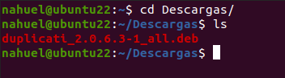

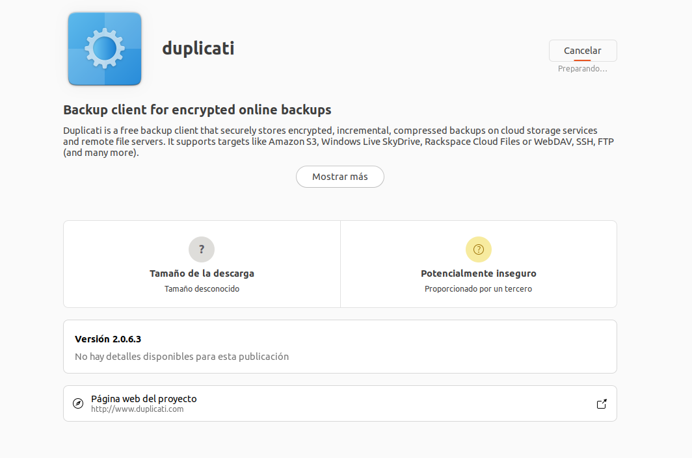

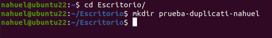

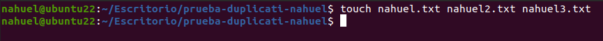

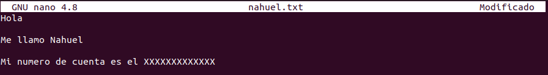

## 2 - Copia de seguridad

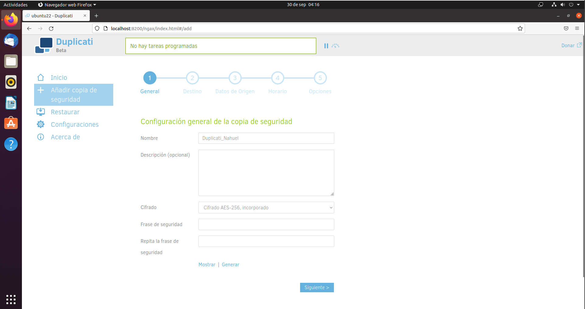

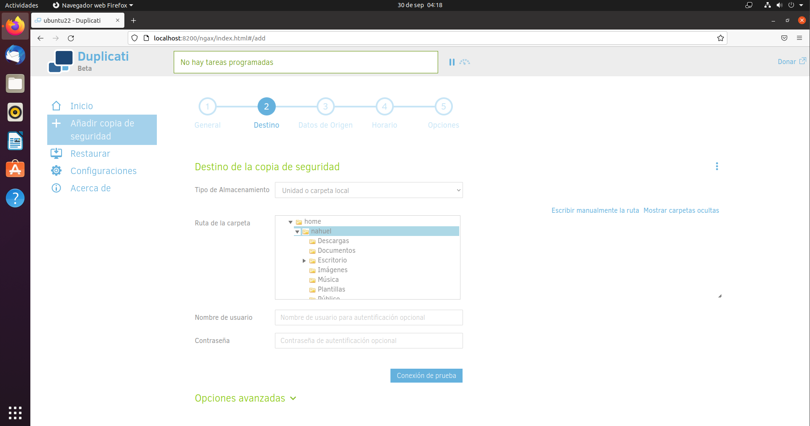

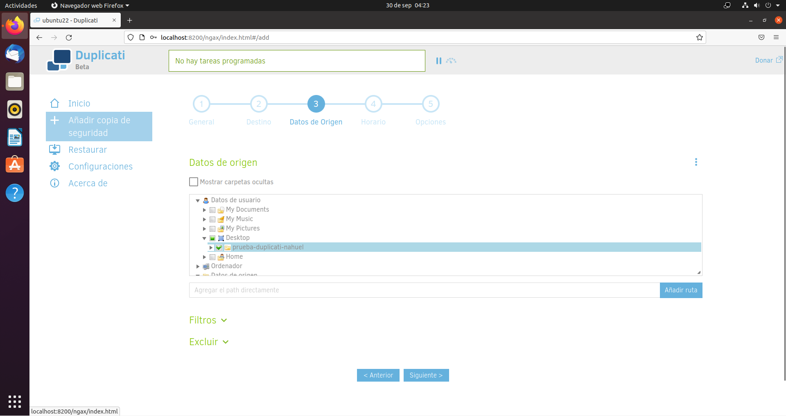

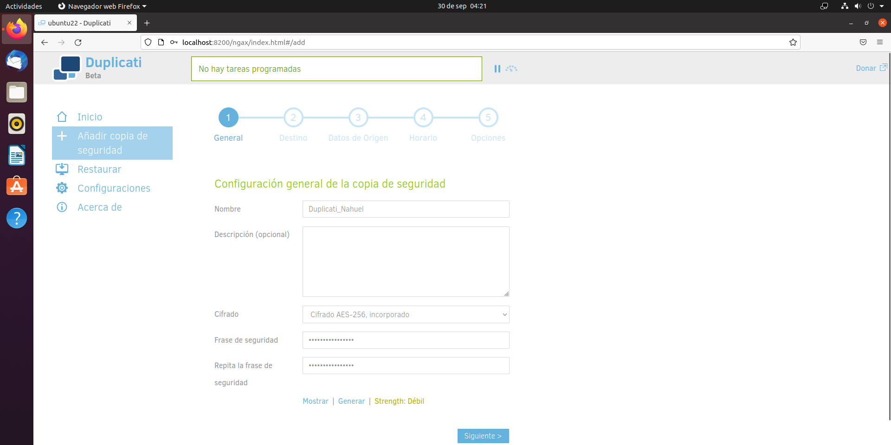

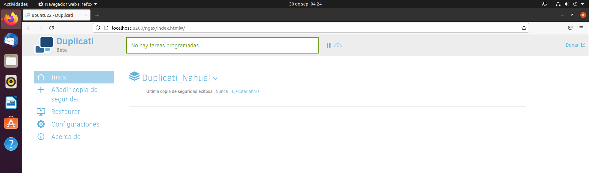

## 3 - Eliminación de archivos

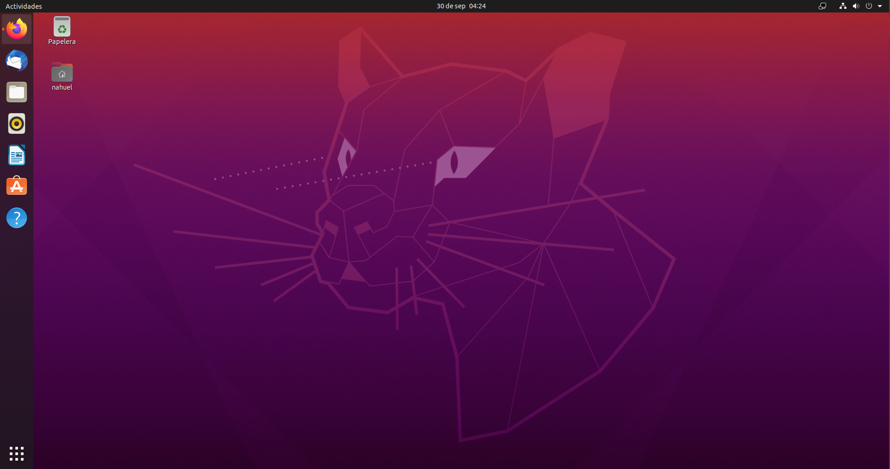

## 4 - Recuperación de archivos

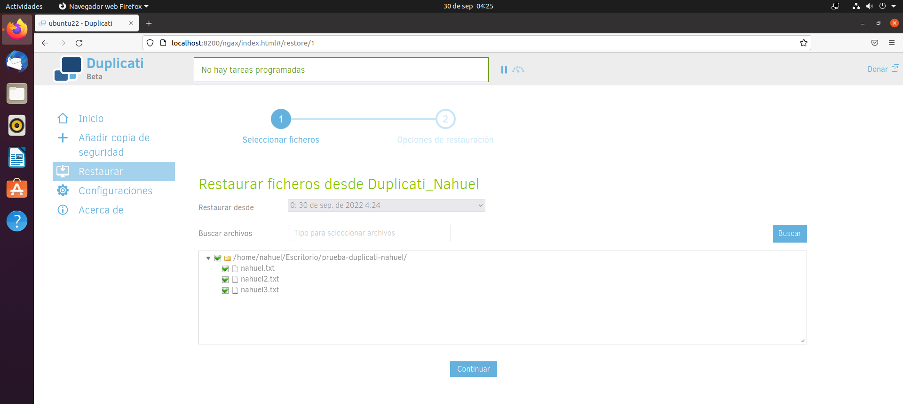

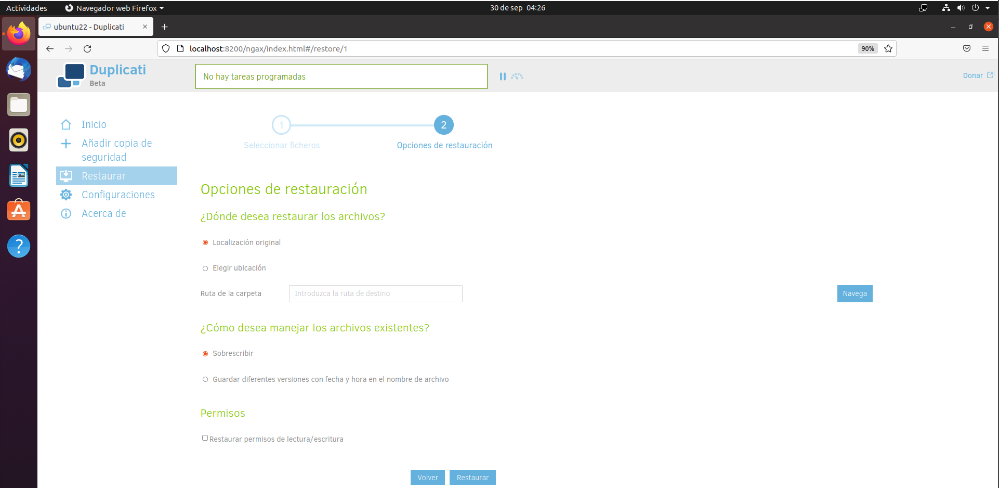

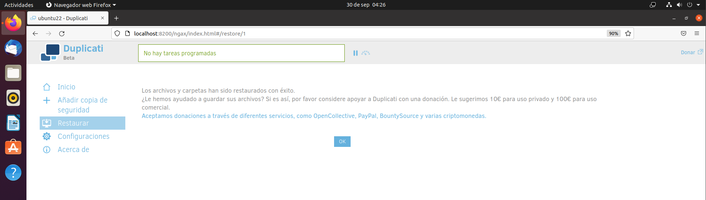

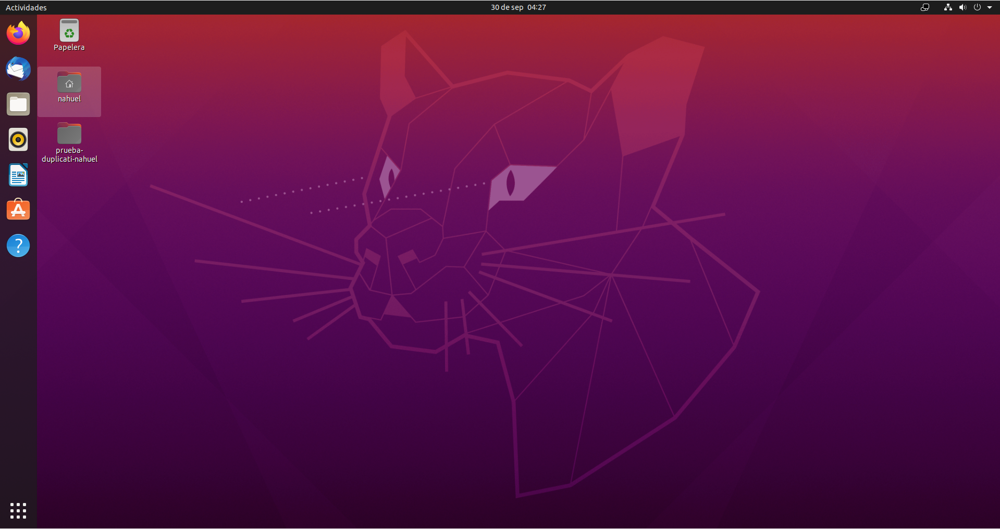

## ***Conclusiones***. 

En esta parte debemos exponer las conclusiones que sacamos del desarrollo de la prácica.
