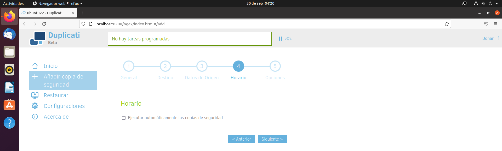

# COPIAS DE SEGURIDAD CIFRADAS - DUPLICATI

***Nombre:*** Nahuel Ivan Troisi

 

***Curso:*** 2º de Ciclo Superior de Administración de Sistemas Informáticos en Red.

## ÍNDICE

+ [Introducción](#id1)
+ [Objetivos](#id2)
+ [Material empleado](#id3)
+ [Desarrollo](#id4)
+ [Conclusiones](#id5)

## ***Introducción***. 

Vamos a realizar una práctica de creación y restauración de copias de seguridad. 

## ***Objetivos***. 

La finalidad de ésta es aprender a crear y gestionar las copias de seguridad de nuestro equipo personal o los equipos corporativos. 

## ***Material empleado***. 

El material que hemos empleado ha sido una máquina virtual con Ubuntu y el programa denominado "Duplicati".

## ***Desarrollo***. 

## 1 - Instalación de Duplicati

Vamos a instalar Duplicati en nuestra MV de Ubuntu. Para ello, vamos a descargar el programa desde la web oficial y posteriormente, procederemos a instalarlo
dándole doble click sobre el mismo.

El archivo de se aloja en el directorio ***Descargas*** por defecto. 

 

 

El gestor de aplicaciones de Ubuntu nos va a facilitar la instalación del programa, ya que de lo contrario seria necesario utilizar el terminal. 

 

## 2 - Creación de archivos

Vamos a crear una carpeta en el Escritorio y en ella vamos a alojar una serie de archivos con tipología "txt" para que sea mas sencillo de trabajar 
a la hora de almacenar información o datos, quedando de la siguiente forma:

 

## 3 - Copia de seguridad

Ahora vamos a proceder a utilizar Duplicati, donde vamos a seguir los pasos que se detallan a continuación con la finalidad de crear una copia de seguridad
de los archivos que habíamos creado posteriormente. 

 

Definimos el nombre de la copia de seguridad. 

Elegimos la ruta donde se va a almacenar dicha copia. 

Seleccionamos los archivos que queremos copiar. 

Omitimos los horarios predefinidos para realizar copias, ya que no vamos a realizarlas frecuentemente. 

Establecemos una contraseña para cifrar los archivos. 

Una vez realizada la copia, Duplicati nos muestra el estado de la misma. 

## 4 - Eliminación de archivos

Vamos a eliminar la carpeta con sus respectivos archivos del Escritorio. 

## 5 - Recuperación de archivos

Seleccionamos los archivos a restaurar. 

Definimos una ruta para dichos archivos. 

La operación es realizada correctamente.

Comprobamos que se han restaurado los archivos.

## ***Conclusiones***. 

En esta práctica hemos podido desarrollar el uso de herramientas para la recuperación de nuestros archivos en caso de pérdida, algo muy útil a tener en cuenta
si esos datos son de vital importancia para nosotros, ya que no basta con tenerlos bien guardados, sino que hay que disponer de una copia en caso de emergencia. 
