

# COPIAS DE ARCHIVOS - RSYNC

***Nombre:*** Nahuel Ivan Troisi
 
***Curso:*** 2º de Ciclo Superior de Administración de Sistemas Informáticos en Red.

### ÍNDICE

+ [Introducción](#id1)
+ [Objetivos](#id2)
+ [Material empleado](#id3)
+ [Desarrollo](#id4)
+ [Conclusiones](#id5)

#### ***Introducción***. 

Vamos a realizar una práctica con RSync para copiar archivos de una MV a otra. 

#### ***Objetivos***. 

El objetivo es copiar varios archivos de una MV a otra, además de comprobar si, en caso de borrar o editar los archivos, los cambios se hacen efectivos. 

#### ***Material empleado***. 

En este caso hemos hecho uso de dos MV con Ubuntu para realizar las comprobaciones de RSync, no obstante, para realizar el informe hemos hecho uso de una MV
con Kali Linux. 

#### ***Desarrollo***. 

En primer lugar, vamos a configurar las dos máquinas virtuales con dos IP que sean fáciles de reconocer, por lo que le vamos a asignar las direcciones
"172.19.99.1" y "172.19.99.2" respectivamente. 

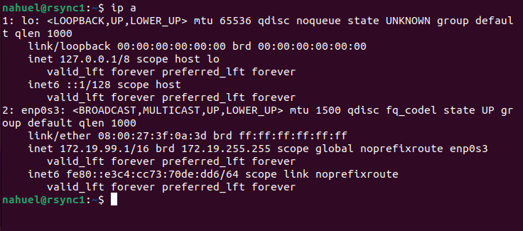

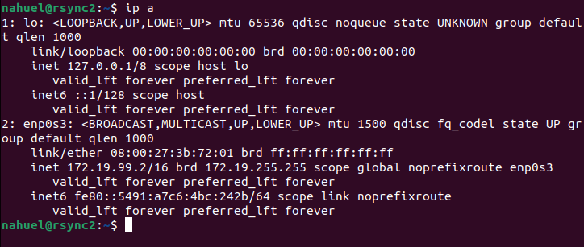

A continuación, vamos a crear la carpeta "datos_nahuel" en la MV 1, donde vamos a almacenar 100 archivos. 

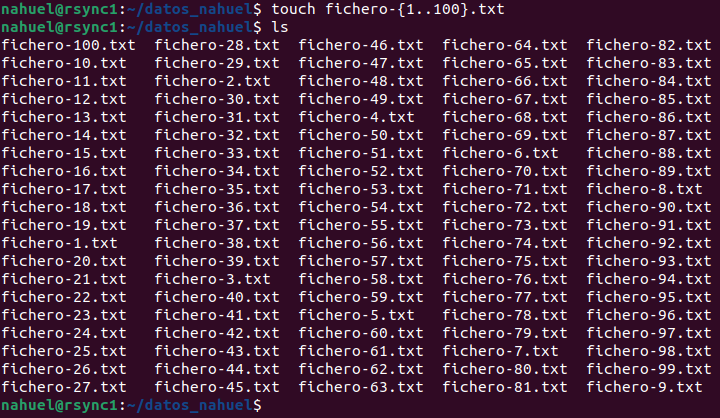

Una vez realizado este proceso, vamos a aplicar "Rsync" para copiar estos archivos a la otra MV. 

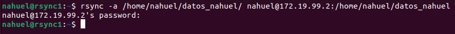

Comprobamos que se han copiado correctamente. 

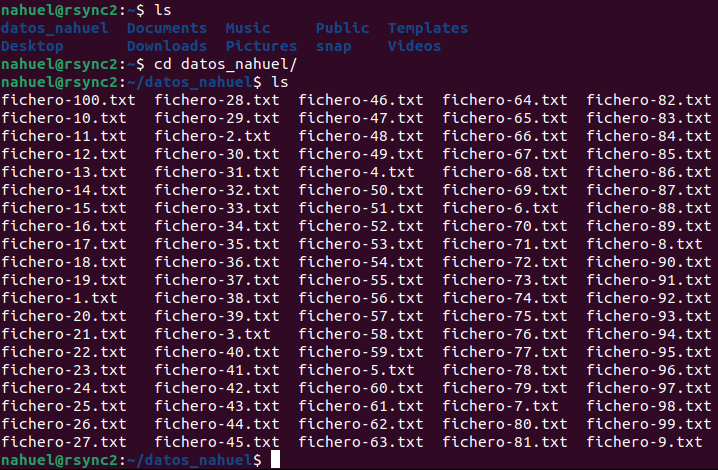

Posteriormente, vamos a editar el fichero "1" y vamos a comprobar si se aplican los cambios en la otra MV al realizar "RSync". 

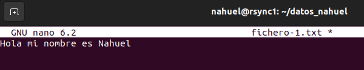

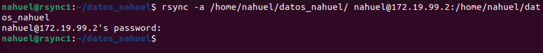

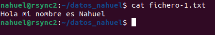

Como podemos comprobar, "RSync" sincroniza los cambios realizados entre las dos MV. 

 

Ahora vamos a probar a borrar el archivo "100" y comprobar si se hace el mismo proceso en la MV 2. 

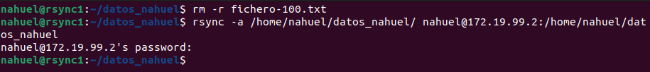

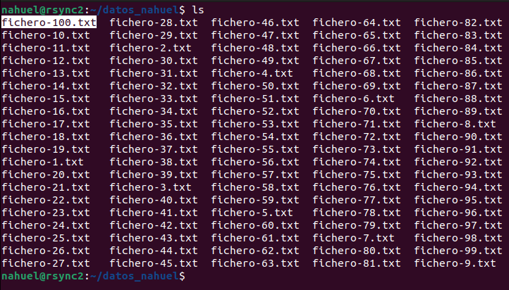

No obstante, el fichero sigue apareciendo en la MV 2. 

 

Para que los cambios se hagan efectivos debemos usar el parámetro "--delete" al final del comando.

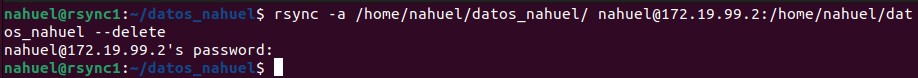

Si provamos a hacer una comprobación nuevamente, veremos que el archivo "100" se ha borrado correctamente. 

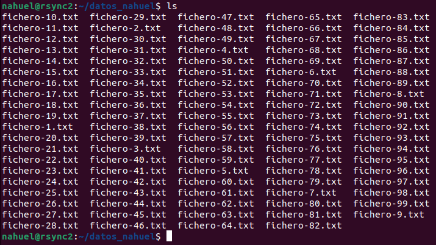

Finalmente, vamos a crear la carpeta "system.d_nahuel" en la MV 2, la cual vamos a sincronizar con el directorio "/etc/systemd" de la MV 1 con el parámetro
"-r". 

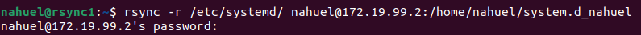

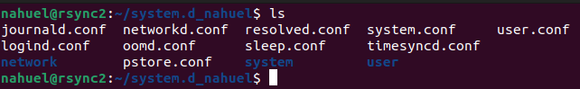

#### ***Conclusiones***. 

Esta práctica ha sido mas sencilla y rápida que la anterior, ya que únicamente debíamos hacer uso de un par de comandos y hacer las respectivas comprobaciones. 
