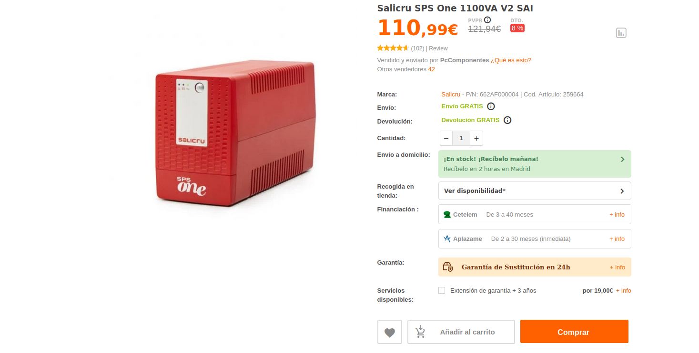
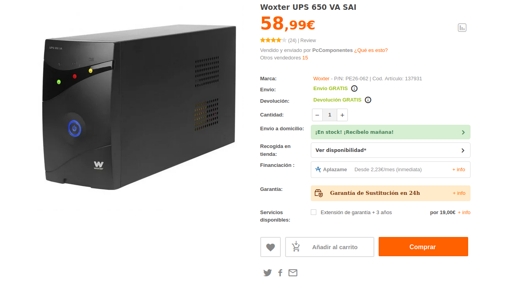

# CÁLCULO DE UN SAI

***Nombre:*** Nahuel Ivan Troisi
 
***Curso:*** 2º de Ciclo Superior de Administración de Sistemas Informáticos en Red.

### ÍNDICE

+ [Introducción](#id1)
+ [Objetivos](#id2)
+ [Material empleado](#id3)
+ [Desarrollo](#id4)
+ [Conclusiones](#id5)

#### ***Introducción***. 

#### ***Objetivos***. 

#### ***Material empleado***. 

#### ***Desarrollo***. 

En primer lugar, vamos a hacer un cálculo de los consumos de los equipos que tenemos en nuestra habitación, entre los que se encuentran los siguientes. 

| PC Sobremesa | Router | Monitores | Switch |
|--------------|--------|-----------|--------|
| 600W         | 15W    | 50W       | 5W     |
|              |        |           |        |
|              |        |           |        |

Dado este cálculo, podemos deducir que el consumo total va a ser de unos 670W aproximadamente. No obstante, vamos a darle un margen de potencia para que el SAI no se
encuentre al máximo de capacidad cuando esté en uso, por lo que vamos a ampliar 130W más el consumo inicial, lo que equivale a 1.100VA com un factor de potencia
del 0.8, por lo que deberemos buscar un SAI que cumpla estas condiciones. 

En caso de que quisiéramos hacer un caćulo similar para nuestro entorno de trabajo, habría que seguir el esquema siguiente. 

| PC Sobremesa | Monitor |
|--------------|---------|
| 350W         | 25W     |
|              |         |
|              |         |

Como podemos observar, el consumo es mucho menor, siendo este de apenas 400W. Al igual que el caso anterior, vamos a establecer un margen extra de consumo de 
alrededor de 500W, lo que supone unos 625VA, con un factor de potencia del 0.8. 

#### ***Conclusiones***. 

