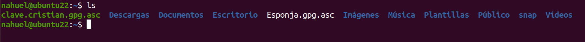

# CIFRADO ASIMÉTRICO - GPG

***Nombre:*** Nahuel Ivan Troisi
 
***Curso:*** 2º de Ciclo Superior de Administración de Sistemas Informáticos en Red.

### ÍNDICE

+ [Introducción](#id1)
+ [Objetivos](#id2)
+ [Material empleado](#id3)
+ [Desarrollo](#id4)
+ [Conclusiones](#id5)

#### ***Introducción***. 

En esta práctica vamos a cifrar una serie de archivos, los cuales se podrán descifrar únicamente con nuestra clave pública. 

#### ***Objetivos***. 

La finalidad de esta práctica es aprender a crear unas claves público-privadas y hacer uso de los archivos encriptados, los cuales sólo se pueden leer
gracias a la clave pública de su creador. 

#### ***Material empleado***. 

Para la realización de la práctica hemos utilizado una MV con Ubuntu 22 y para el informe hemos recurrido a la MV de Kali Linux. 

#### ***Desarrollo***. 

En primer lugar, vamos a generar una clave público-privada mediante GPG, la cual consta de tipo RSA a RSA, una longitud de 4096 bits y la caducidad de la misma
es nula. 

Una vez creada, nos solicitará una contraseña para poder proteger nuestra clave. En este caso hemos definido una muy sencilla "12345678A", pero podemos
utilizar una diferente si se desea. 

Si hacemos uso del comando "gpg -k" podremos visualizar las características de nuestra clave recién creada. 

Ahora vamos a exportar nuestra clave al formato "asc". 

Si hacemos uso de "cat" para comprobar el resultado de la exportación, nos debería de aparecer lo siguiente. 

Lo que acabamos de ver es nuestra clave pública encriptada. Si queremos enviarnos mensajes con otro usuario, necesitaremos un archivo similar. En este caso
mi compañero Cristian me ha enviado su clave pública encriptada, la cual vamos a copiar en un archivo de texto y lo vamos a denominar "clave.cristian.gpg.asc". 

Y quedaría de la siguiente manera. 

Ahora vamos a importar la clave de Cristian, la cual hemos copiado anteriormente en el archivo de texto. 

Posteriormente, nosotros vamos a crear un archivo de texto con un mensaje en su interior, con la intención de encriptarlo y que Cristian lo pueda descifrar
y leer gracias a la clave pública que le hemos proporcionado. 

Encriptamos el archivo en cuestión. 

Una vez encriptado quedaría tal que así. 

A continuación, Cristian nos ha mandado un mensaje encriptado, el cual es el siguiente. 

Procedemos a descifrarlo gracias a su clave pública. 

Introducimos la clave que definimos al principio de la práctica. 

Y el mensaje de Cristian es el siguiente. 

#### ***Conclusiones***. 

El cifrado de archivos ha estado una práctica muy interesante. De este modo podemos ampliar el nivel de seguridad de nuestros archivos personales
y podemos decidir quien tiene acceso a los mismos. 

