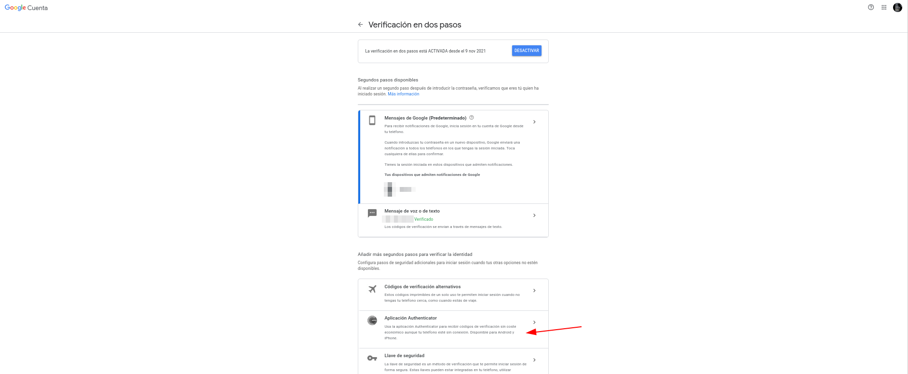

# GESTOR DE CONTRASEÑAS - BITWARDEN

***Nombre:*** Nahuel Ivan Troisi
 
***Curso:*** 2º de Ciclo Superior de Administración de Sistemas Informáticos en Red.

### ÍNDICE

+ [Introducción](#id1)
+ [Objetivos](#id2)
+ [Material empleado](#id3)
+ [Desarrollo](#id4)
+ [Conclusiones](#id5)

#### ***Introducción***. 

En esta práctica vamos a hacer uso de la herramienta Bitwarden para gestionar las contraseñas de nuestras cuentas.

#### ***Objetivos***. 

El objetivo de esta práctica es conseguir gestionar y asegurar nuestras contraseñas de una manera más segura. 

#### ***Material empleado***. 

En esta práctica hemos hecho uso de la MV de Kali Linux tanto para la instalación y configuración de Bitwarden como para la realización del informe. 

#### ***Desarrollo***. 

En primer lugar, vamos a descargar la aplicación de Bitwarden para escritorio, la cual podemos encontrar en su página oficial. Cabe destacar que también podemos 
tener acceso a la plataforma a través de la web sin necesidad de descargar ningún archivo. 

Una vez descargado, procedemos a su instalación. 

Si abimos la aplicación, nos aparecerá esta interfaz para poder acceder a la misma. 

Si introducimos nuestro usuario y contraseña, podremos tener acceso a las distintas contraseñas que hayamos definido previamente. En mi caso personal
ya usaba esta herramienta desde hace tiempo, por lo que tengo almacenadas una gran cantidad de contraseñas. 

Para mejorar aún más la seguridad en nuestra cuenta de Bitwarden, vamos a activar el acceso de códigos 2FA haciendo uso de aplicaciones como Google Authenticator. 

Procedemos a escanear el código QR y ya quedaría añadido Bitwarden a nuesto Google Autheticator. 

Y vamos a realizar el mismo paso para nuestra cuenta de correo la cual hemos configurado para poder acceder a Bitwarden. De esta manera, dificultaremos la posibilidad
tanto de averiguar las contraseñas de Bitwarden como las que podamos haber guardado en nuestra cuenta de Google. 

Añadimos el 2FA a nuestra cuenta de Google. 

Y escaneamos el código QR. 

Introducimos el código que se genera en Google Authenticator. 

Y ya quedaría configurado para acceder mediante 2FA cuando iniciemos sesión con nuestro Gmail. 

Como podemos comprobar, nos solicita el código 2FA para poder acceder a nuestra cuenta. 

Y en caso de querer acceder a Bitwarden para copiar una de nuestras contraseñas y acceder al servicio que hayamos guardado, primero deberemos introducir
la contraseña maestra. 

Pero además tendremos que introducir el código 2FA, ya que habíamos definido esta medida de seguridad anteriormente. 

Y finalmente podremos tener acceso a nuestras contraseñas. 

#### ***Conclusiones***. 

Esta práctica es bastante útil para nuestro día a día, ya que estamos constantemente creando usuarios y contraseñas en miles de servicios y seguramente 
la gran mayoría siempre configuramos la misma contraseña para todo. De este modo, podemos evitar el acceso no autorizado a nuestras cuentas, ya que el generador
de contraseñas de Bitwarden nos permite crear contraseñas con caracteres de gran longitud, además de poseer caracteres especiales como ".", "_" o "-", lo cual
dificulta en gran medida la posibilidad de averiguar nuestra contraseña, además de que hace uso de números y letras, tanto en mayúscula como minúscula. 

