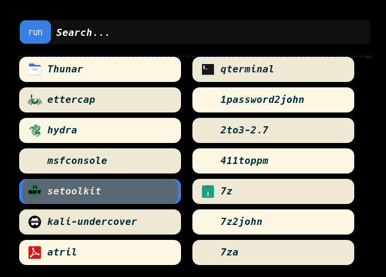
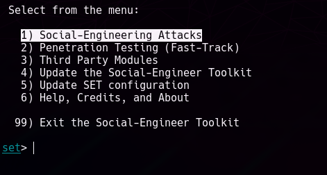
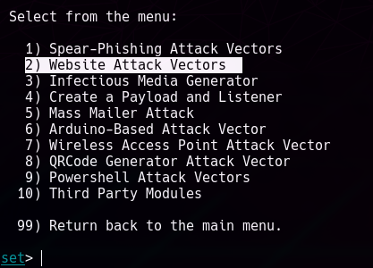
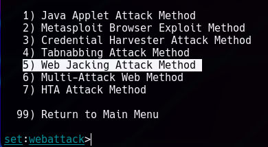
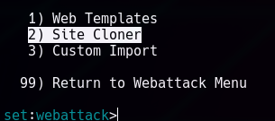
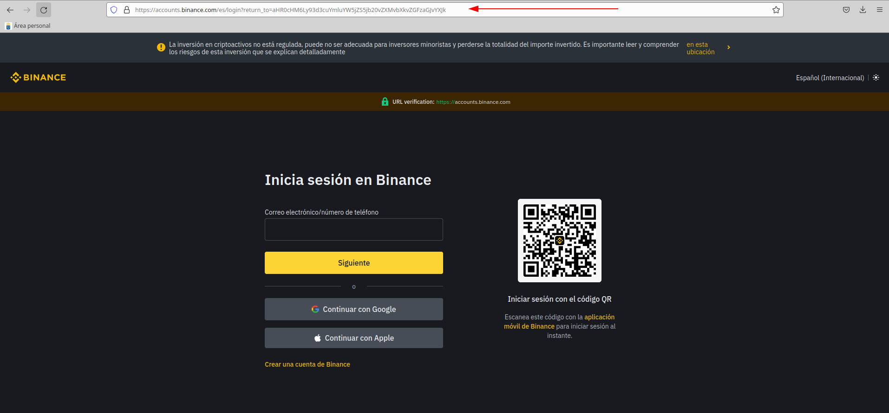
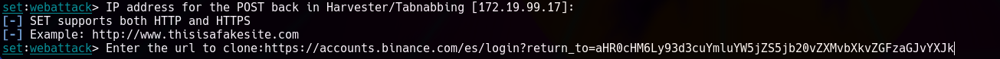
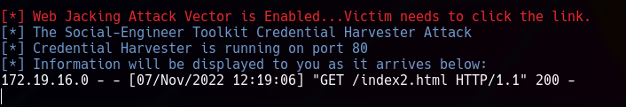

# PHISHING - SET

***Nombre:*** Nahuel Ivan Troisi
 
***Curso:*** 2º de Ciclo Superior de Administración de Sistemas Informáticos en Red.

### ÍNDICE

+ [Introducción](#id1)
+ [Objetivos](#id2)
+ [Material empleado](#id3)
+ [Desarrollo](#id4)
+ [Conclusiones](#id5)

#### ***Introducción***. 

En esta práctica vamos a clonar un sitio web con la finalidad de ganar acceso al usuario y contraseña de la víctima.

#### ***Objetivos***. 

Clonar la página web y conseguir sus credenciales. 

#### ***Material empleado***. 

Hemos empleado la MV de Kali Linux tanto para el uso de SET como para elaborar el informe. 

#### ***Desarrollo***. 

En primer lugar, vamos a inicar el servicio de SET (Social Engineering Toolkit).

Una vez arrancado el servicio, vamos a elegir de todas las opciones, la que se encuentra en primer lugar, es decir, vamos a realizar ataques de ingeniería
social. 

Posteriormente, vamos a utilizar el ataque basado en vectores para las páginas web. 

El paso siguiente es seleccionar el método de ataque web. 

Seleccionamos la opción de clonar un sitio web. 

El sitio web en cuestión es la web de Binance, el mayor exchange de criptomonedas del mundo, por lo que deberemos de copiar la URL.

Una vez copiada la dirección URL, vamos a pegarla en nuestro SET. 

El programa procederá a clonar la página web y nos informará cuando la víctima haya accedido a la misma, además de facilitarnos el usuario y la contraseña. 

#### ***Conclusiones***. 

Me ha resultado una práctica bastante sencilla, ya que el programa lo automatiza todo. No obstante, la web carece de HTTPS, por lo que es fácil identificar
que la web es falsa o poco fiable. 
