

# DNS - SPOOFING

***Nombre:*** Nahuel Ivan Troisi
 
***Curso:*** 2º de Ciclo Superior de Administración de Sistemas Informáticos en Red.

### ÍNDICE

+ [Introducción](#id1)
+ [Objetivos](#id2)
+ [Material empleado](#id3)
+ [Desarrollo](#id4)
+ [Conclusiones](#id5)

#### ***Introducción***. 

En esta práctica vamos a realizar un envenenamiento DNS. 

#### ***Objetivos***. 

Usar nuestra MV como DNS y captar todo el tráfico de red. 

#### ***Material empleado***. 

Para la práctica hemos hecho uso de la MV de Kali Linux tanto para los ataques como para el informe. 

#### ***Desarrollo***. 

En primer lugar, vamos a abrir el programa Ettercap. 

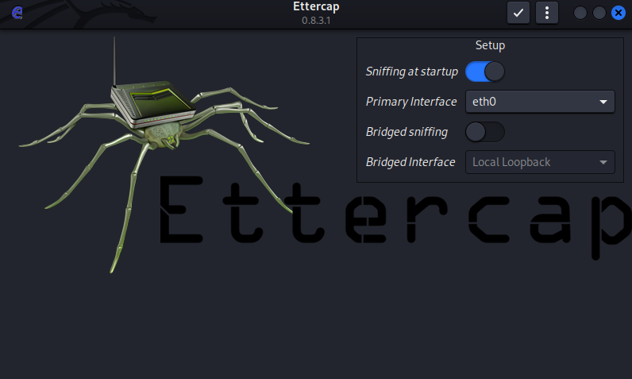

Una vez iniciado, vamos a prodecer a hacer un escaneo de la red y los hosts que nos encontramos en la misma. 

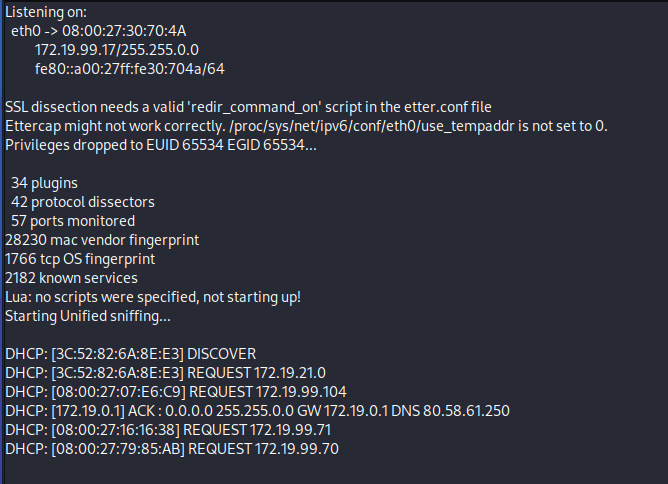

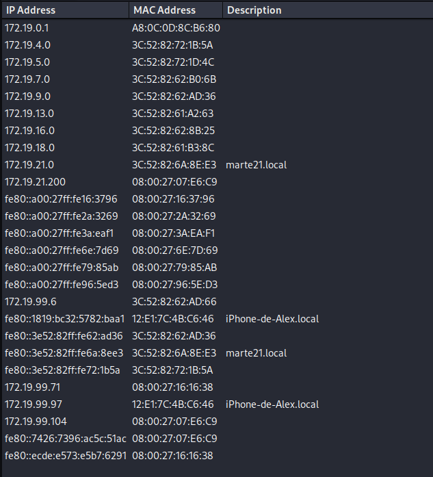

Posteriormente, vamos a identificar la IP de la víctima, la cual es 172.19.99.104, cuya puerta de enlace es la 172.19.0.1. Dichos valores los vamos a añadir
como "Target 1" y "Target 2" respectivamente. 

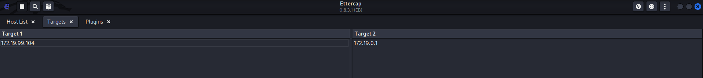

Activamos el esnifado de las conexiones remotas. 

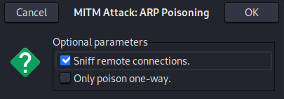

El programa procede a poner nuestra MV como DNS y por ende, a envenenar dicho servicio. 

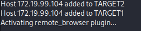

Y como podemos comprobar, cada vez que la víctima acceda a una página web, se nos abrirá una copia en nuestro navegador. 

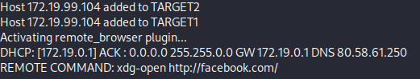

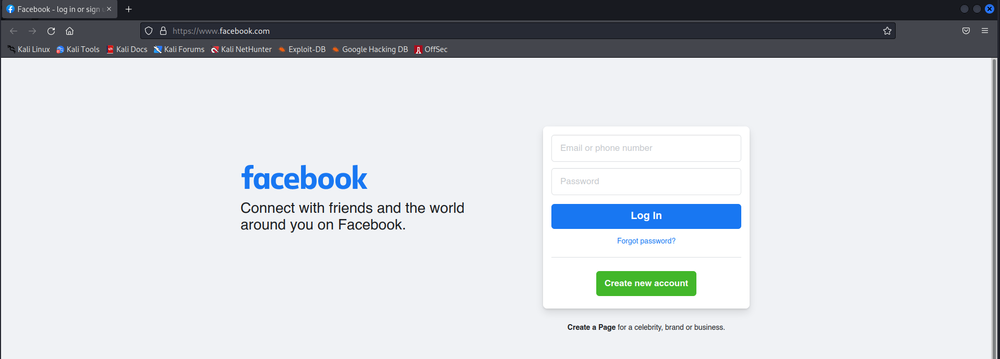

Otro método que podemos aplicar es el DNS SPOOFING, lo que consiste en usar nuestra máquina como servidor DNS, por lo que, cuando la víctima acceda a una web
realmente será nuestra máquina la que le esté proporcionando la URL, lo que no da acceso a sus credenciales. 
Es por ello que, en primer lugar, deberemos de editar el archivo de configuración de Ettercap, añadiendo la web que queremos suplantar, en este caso, Facebook. 

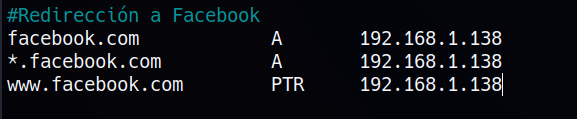

Posteriormente, abrimos Ettercap y añadimos los respectivos Target. 

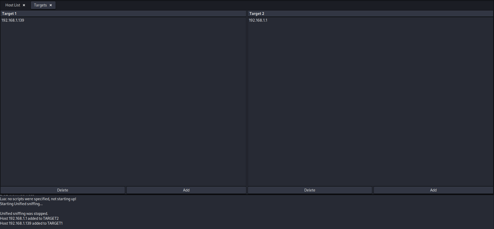

Activamos el esnifado de conexiones remotas. 

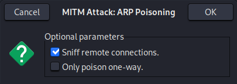

Habilitamos el plugin de dns_spoof. 

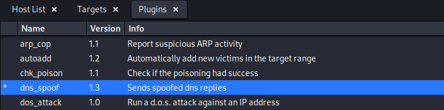

Y probamos a acceder a la página web de Facebook con la máquina víctima, donde nos listará sus credenciales cuando éste intente entrar a la web. 

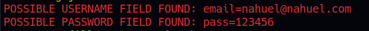

#### ***Conclusiones***. 

Una práctica muy útil para poder espiar a la víctima y saber en que páginas web podemos tener acceso como atacantes, además de conocer sobre qué
páginas podemos hacer un ataque de phishing que resulte exitoso. 
