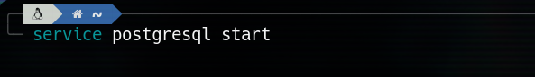
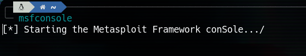
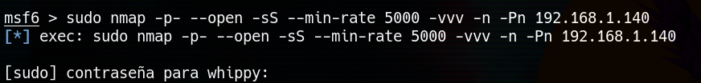
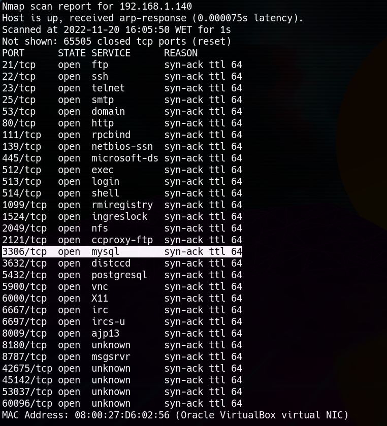
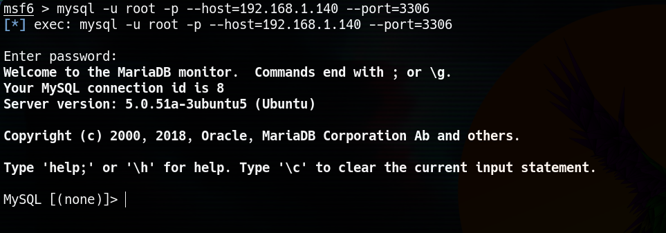
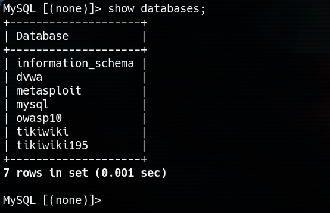
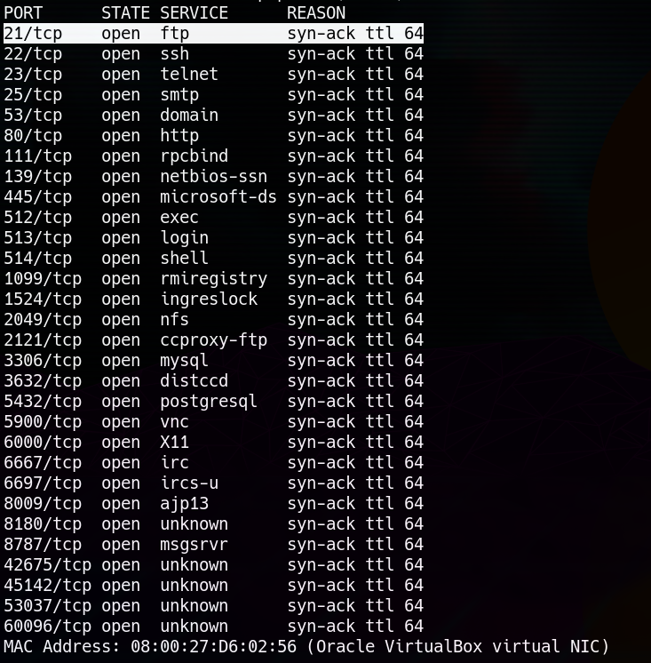
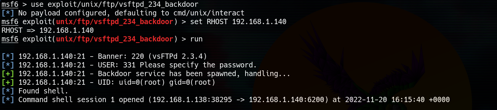
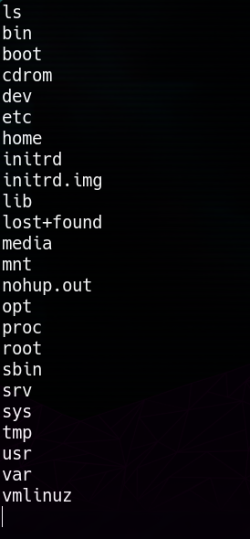

# METAESPLOITABLE 2 - VULNERABILIDADES

***Nombre:*** Nahuel Ivan Troisi
 
***Curso:*** 2º de Ciclo Superior de Administración de Sistemas Informáticos en Red.

### ÍNDICE

+ [Introducción](#id1)
+ [Objetivos](#id2)
+ [Material empleado](#id3)
+ [Desarrollo](#id4)
+ [Conclusiones](#id5)

#### ***Introducción***. 

Vamos a explotar las vulnerabilidades de una MV víctima con el fin de ganar acceso a la misma. 

#### ***Objetivos***. 

Ganar acceso a la MV y por ende, a los datos que almacena. 

#### ***Material empleado***. 

Hemos empledo una MV de Kali Linux para poder hacer los ataques, además de poder redactar el informe y como máquina víctima hemos hecho uso de Metaesploitabe 2. 

#### ***Desarrollo***. 

En primer lugar, vamos a activar el servicio "postgresql" con el fin de dejar registrado todos los escaneos que vayamos realizando. 

Posteriormente, vamos a abrir Metaesploid. 

Una vez cargado, vamos a realizar un escaneo de la MV, obteniendo los resultados que se adjuntan a contiunuación. 

Como podemos ver, el puerto 3306 (donde se ejecuta MYSQL) se encuentra abierto, por lo que vamos a proceder a atacar por ahí. 
Desde la terminal de Metasploid, vamos a probar a conectarnos a la base de datos, la cual, si no está configurada correctamente, puede carecer de contraseña. 

Como podemos ver, hemos podido acceder sin problemas y tenemos acceso a toda la información. 

Otro puerto que se encuentra abierto es el 21, donde tenemos el servicio FTP. 

Al igual que en el caso anterior, desde Metaesploid vamos a introuducir la IP de la máquina víctima y vamos a ejecutar un exploit que nos debería de ganar acceso
a la MV. 

Y como podemos observar, estamos dentro. 

#### ***Conclusiones***. 

Una práctica bastante guiada y fácil de seguir, quizás sería más recomendable algo similar pero careciendo de los pasos a seguir, para poder realizar el trabajo
de investigación por uno mismo, ya que hay muchas formas de acceder a esta MV. 

