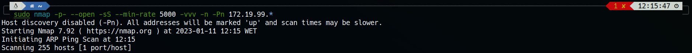
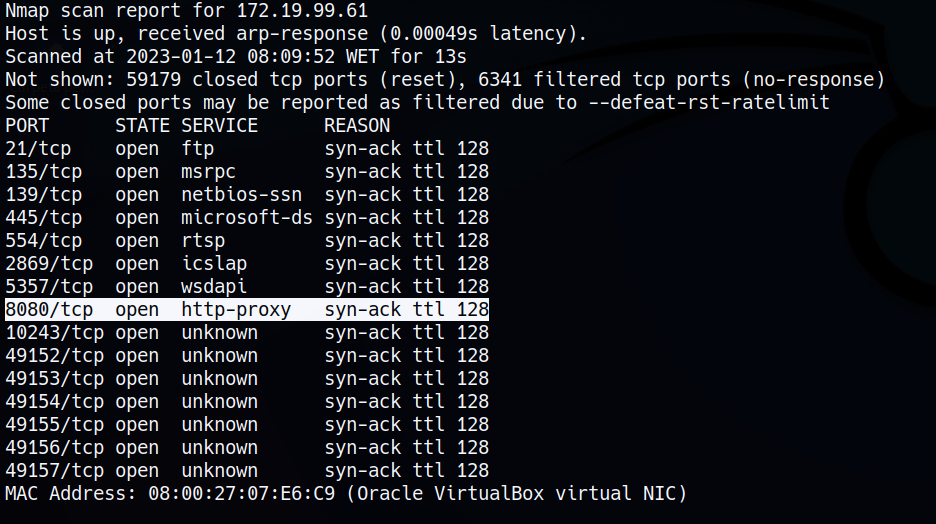
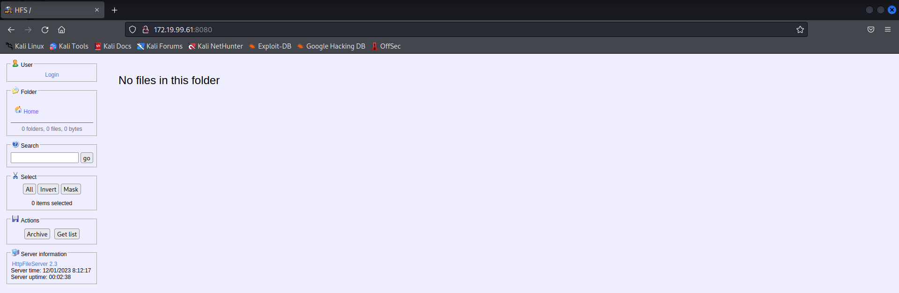
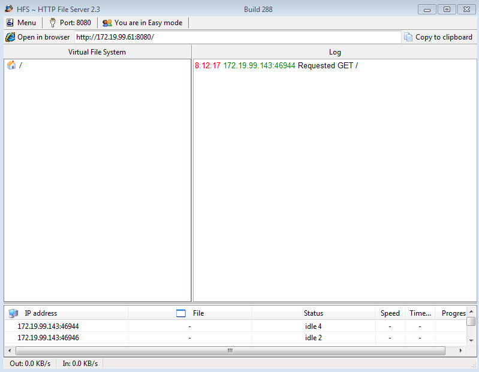
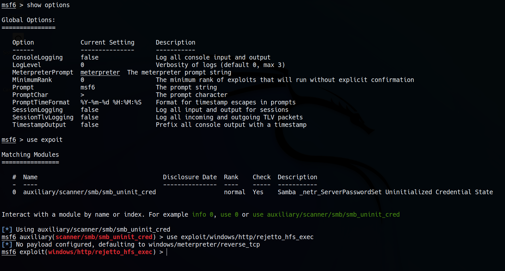
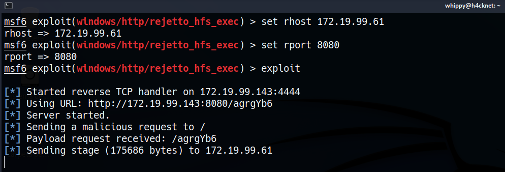
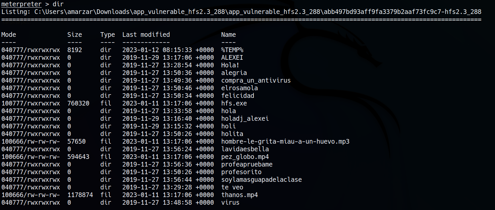
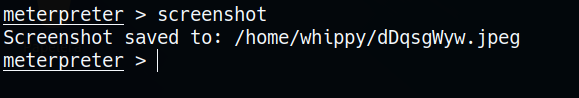
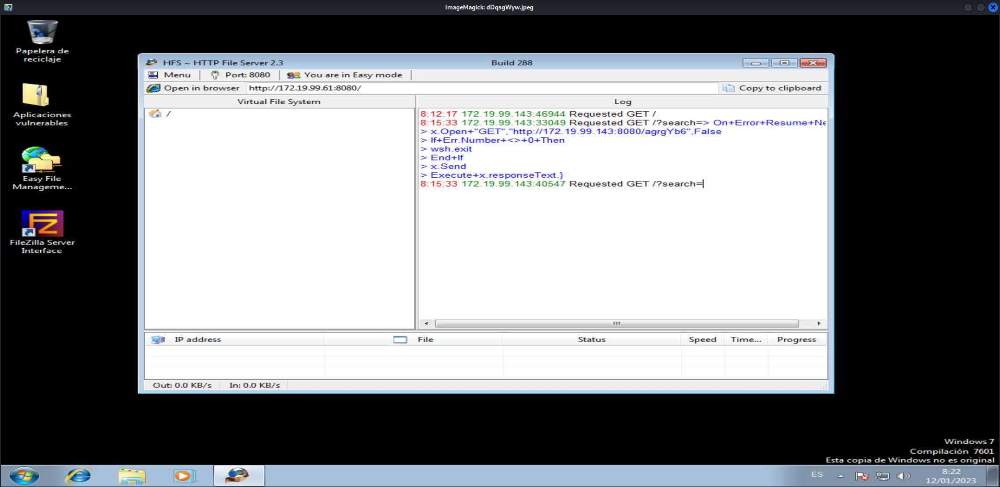

# HACKEO DE WINDOWS 7 

***Nombre:*** Nahuel Ivan Troisi
 
***Curso:*** 2º de Ciclo Superior de Administración de Sistemas Informáticos en Red.

### ÍNDICE

+ [Introducción](#id1)
+ [Objetivos](#id2)
+ [Material empleado](#id3)
+ [Desarrollo](#id4)
+ [Conclusiones](#id5)

#### ***Introducción***. 

En esta práctica vamos a hackear una MV con Windows 7 mediante el uso de comandos en terminal. 

#### ***Objetivos***. 

Conseguir acceso a la máquina sin levantar sospechas. 

#### ***Material empleado***. 

Hemos usado una MV de Kali Linux para efectuar el ataque y otra de Windows 7 como víctima para el proceso. 

#### ***Desarrollo***. 

En primer lugar vamos a escanear toda la red para ver si hay alguna máquina que tenga algún servicio web activo (mediande el puerto 80 o el 8080). 

Como podemos observar, hay una máquina con varios puertos activos, entre ellos, el puerto 8080. Además, el puerto 445 nos adelanta que nos encontramos ante una máquina Windows, debido al servicio que presta, propio de Microsoft. Pero en caso de que este puerto no estuviera activo, el "TTL" nos indica ante que tipo de sistema nos encontramos. Si fuera Linux, sería menor de 64, pero como es Windows, su valor es superior a éste. 

Una vez indetificada la posible víctiva, vamos a ver qué se encuentra activo en el puerto 8080. Para ello, escribimos la IP de la máquina, seguido del puerto en cuestión. 

~~~
172.19.99.61:8080
~~~

Si nos dirigimos a la máquina víctima, podemos ver que se ha registrado nuestra visita a la web.

En este punto, nos dirigimos a nuestra MV de Kali Linux y ejecutamos ***msfconsole***, el cual nos permite usar varios ***exploits*** para poder aprovechar las vulnerabilidades a nuestro favor. 
Es por ello que vamos a seleccionar una en concreto.

~~~
use exploit/windows/http/rejetto_hfs_exec
~~~

Como ya conocemos el puerto y la IP de la víctima, vamos a definirlo en nuestro ***exploit*** para posteriormente efectuar el ataque. 

Una vez realizado el ataque, nos devolverá una sesión de ***meterpreter*** en la cual tendremos control total del sistema. Lo podemos comprobar fácilmente haciendo un ***dir***. 

Una vez dentro, podremos efectuar todo tipo de comandos, ataques e incluso inutilizar por completo la máquina, pero en este caso únicamente vamos a realizar una captura de pantalla para ver lo que está haciendo la víctima. 

#### ***Conclusiones***. 

Me ha resultado una práctica bastante interesante. Si bien es cierto que es sencilla de realizar, está muy orientada a los problemas de vulnerabilidades del mundo real, donde el verdadero problema es el ser humano, el cual no es consciente de lo importante que es mantener el sistema actualizado. 

