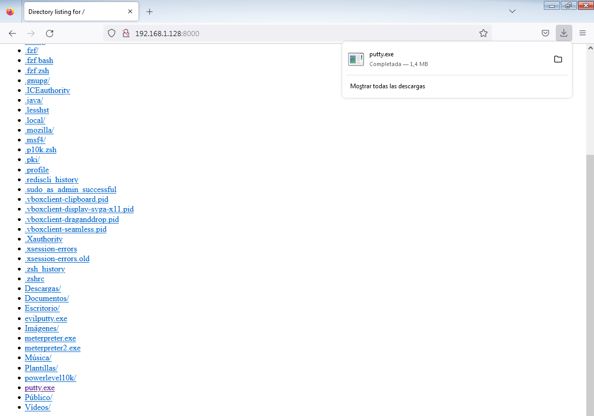

 

# TÉCNICAS DE EVASIÓN

***Nombre:*** Nahuel Ivan Troisi
 
***Curso:*** 2º de Ciclo Superior de Administración de Sistemas Informáticos en Red.

### ÍNDICE

+ [Introducción](#id1)
+ [Objetivos](#id2)
+ [Material empleado](#id3)
+ [Desarrollo](#id4)
+ [Conclusiones](#id5)

#### ***Introducción***. 

En esta práctica vamos a realizar técnicas de evasión con archivos maliciosos. 

#### ***Objetivos***. 

El objetivo es subir el archivo malicioso a VirusTotal con el fin de que gracias a las técnicas de evasión el programa no los pueda detectar. 

#### ***Material empleado***. 

El material empleado es una MV de Kali Linux como atacante y otra MV Windows como víctima. 

#### ***Desarrollo***. 

En primer lugar, vamos a listar los ***encoders*** que nos proporciona ***msfvenom***.

Posteriormente, vamos a crear un ***payload*** con ***msfvenom*** con el nombre de "meterpreter.exe". 

Del mismo modo, vamos a realizar el mismo proceso pero aplicando un filtro para silenciar el archivo, es decir, para que no sea tan fácil de detectar ante un antivirus. 

Como podemos apreciar, los dos archivos se han creado correctamente. 

Si pasamos los archivos por ***VirusTotal*** debería de haber una diferencia entre los mismos, ya que el filtro de silencio que hemos aplicado debería de dificultar que nos detecte el archivo malicioso.

Spoiler: No funciona. 

Posteriormente, descargamos ***Putty*** en nuestra MV. 

Una vez descargado, procedemos a incluirlo en los archivos de ***Metaesploit***. 

Otra opción que podemos tomar en cuenta en la creación de un ***Payload*** a través de meterpreter usando un filtro silencioso como se adjunta a continuación. 

Al igual que la práctica anterior, usamos ***msfconsole*** con el exploit de ***handler***, definiendo nuestra IP y el puerto 80. 

Una vez realizado, vamos a crear un servidor mediante ***python3*** para descargar el archivo malicioso en la MV de Windows. 

Una vez la víctima descargue y ejecute el archivo, se nos mostrará una sesión de ***meterpreter*** con acceso total a la máquina. 

---

Por otro lado, vamos a practicar las técnicas de evasión, es decir, vamos a ocultar esos ***payloads*** creados para que el sistema no los pueda detectar. 
Para ello, vamos a instalar ***veil***.

Una vez instalado y ejecutado el programa, seleccionamos la opción "Evasion". 

A continuación, listamos los ***payloads***. 

Y hacemos uso del siguiente ***payload***.

Posteriormente, establecemos la dirección IP y el puerto, el cual será el 80 en este caso. 

Y finalmente generamos el archivo.

Si lo pasamos por ***VirusTotal*** debería de haber una mejoría respecto a los archivos anteriores. 

---

Otro programa del que podemos hacer uso para la evasión de archivos es ***Shellter***. 

A continuación, definimos el archivo que queremos evadir. 

Finalmente, seleccionamos el ***payload*** a ejecutar y el puerto, así como la dirección IP. 

Y si pasamos el archivo por ***VirusTotal*** debería de haber una mejoría respecto a los archivos anteriores. 

#### ***Conclusiones***. 

 Esta práctica nos sirve para ocultar los archivos maliciosos, algo útil desde el lado del atacante, pero el usuario es el principal perjudicado. Es por ello que debemos tener cuidado las fuentes desde las que descargamos nuestros archivos. 

