

# VPN - PPTD

***Nombre:*** Nahuel Ivan Troisi

 

***Curso:*** 2º de Ciclo Superior de Administración de Sistemas Informáticos en Red.

## ÍNDICE

+ [Introducción](#id1)
+ [Objetivos](#id2)
+ [Material empleado](#id3)
+ [Desarrollo](#id4)
+ [Conclusiones](#id5)

## ***Introducción***. 

Vamos a crear un servicio de conexiones VPN. 

## ***Objetivos***. 

Crear el servicio de conexiones VPN y comprobar que funciona. 

## ***Material empleado***. 

Para la configuración del servicio VPN vamos a utilizar una MV de Kali Linux, mientras que para las comprobaciones pertinentes usaremos una MV con Windows 7. 

## ***Desarrollo***. 

En primer lugar, para poder desarrollar correctamente esta práctica deberemos de configurar nuestra MV con dos adaptadores de red en modo puente, tal y como se muestra a continuación. 

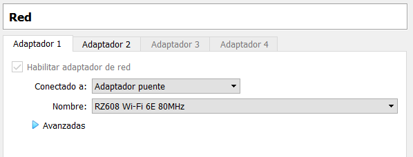

Una vez realiza la configuración previa, procedemos a instalar el servicio de ***PPTD***. 

Posteriormente, vamos a comprobar que ambas tarjetas de red están correctamente configuradas, tal como se muestra en la imagen. 

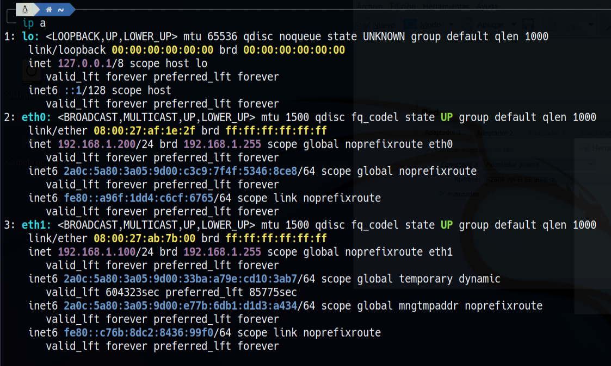

A continuación, vamos a definir el rango de direcciones IP que queremos que asigne nuestra VPN, editando el archivo de configuración siguiente. 

~~~
/etc/pptpd.conf
~~~

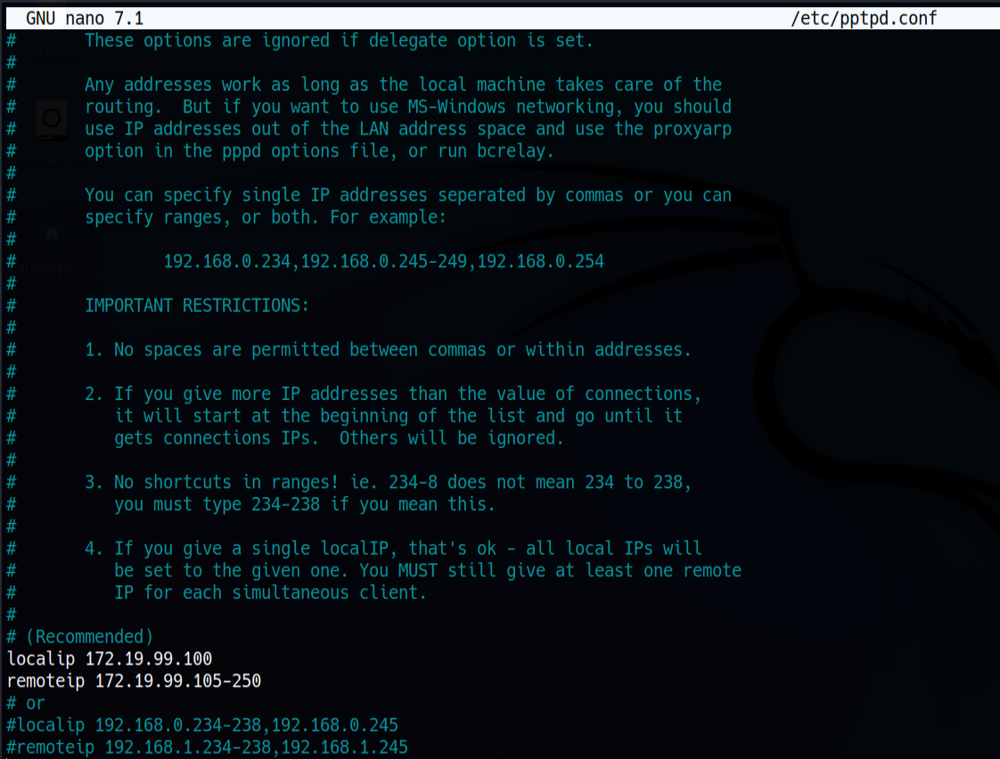

Una vez realizado, vamos a definir un usuario y una clave para el acceso al mismo. En este caso, he elegido una contraseña sencilla, aunque se recomienta utilizar más caracteres. 

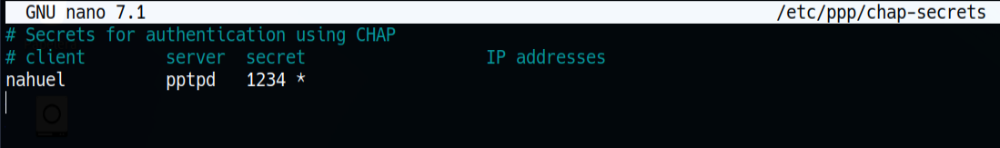

Antes de nada, vamos a cerciorarnos de que las interfaces de red se encuentras bien configuradas, así como el DNS, sino puede inducir a posibles fallos de conexión. 

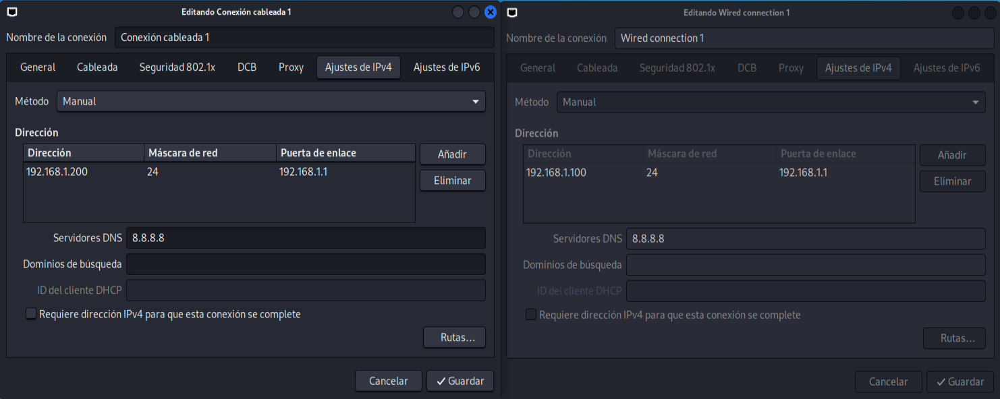

Al igual que en el fichero de configuración anterior, vamos a definir los DNS por los que queremos que pase nuestra VPN, en este caso, hemos definido "1.1.1.1" y "8.8.8.8" respectivamente. 

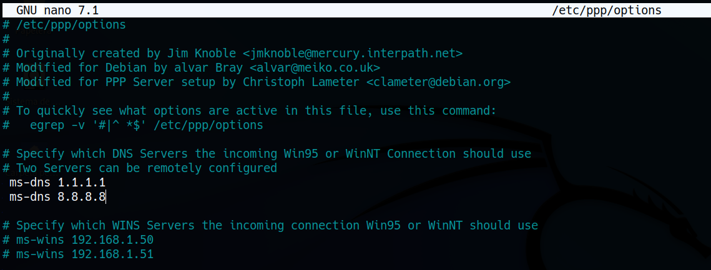

Una vez realizado, ejecutamos el comando siguiente con el fin de comprobar si existe el reenvío de paquetes.

~~~
sysctl net.ipv4.ip_forward
~~~

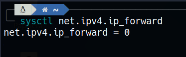

Dado que el valor es "0" quiere decir que no se encuentra activo, por lo que vamos a proceder a habilitarlo mediante el comando siguiente. 

~~~
sysctl -w net.ipv4.ip_forward=1
~~~

Una vez realizado, vamos a verificar que se ha efectuado el cambio correctamente en el fichero siguiente. 

~~~ 
/etc/sysctl.conf
~~~

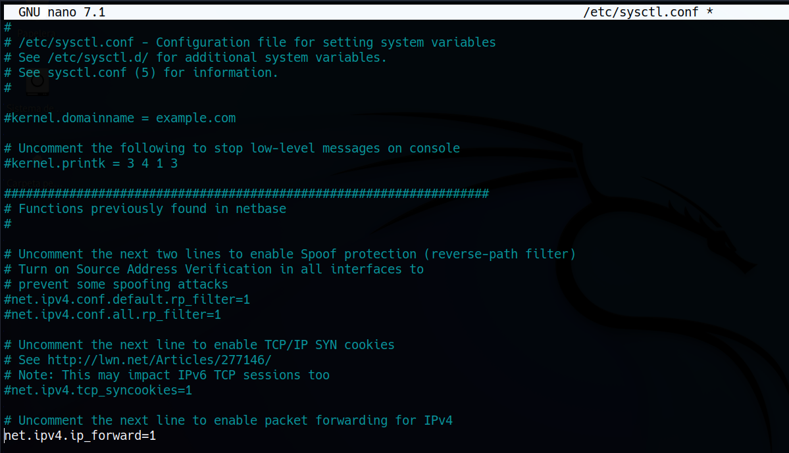

Una vez finalizada la configuración de la VPN, procedemos a conectarnos mediante un cliente Windows. 

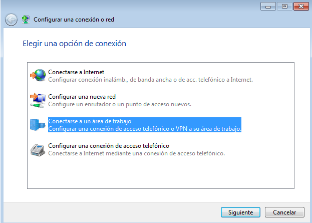

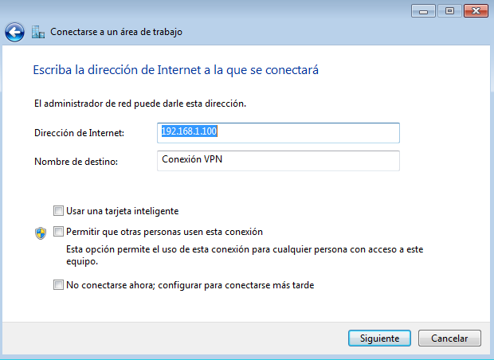

Nos pedirá el usuario y contraseña que hemos definido previamente. 

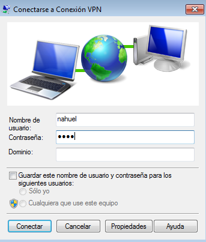

Y finalmente comprobamos si se efectúa la conexión. 

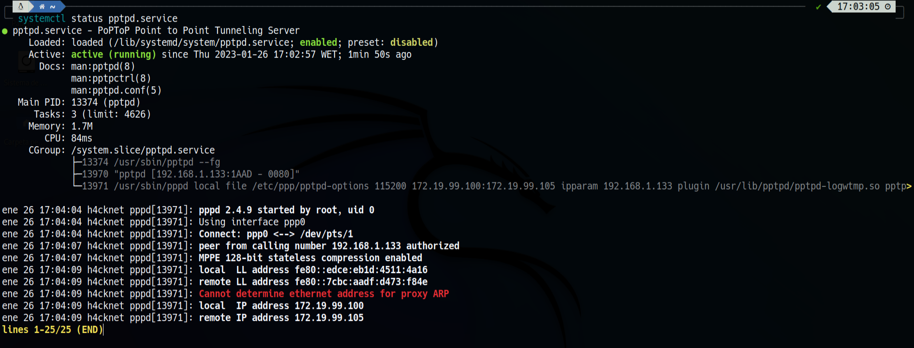

## ***Conclusiones***. 

La práctica ha resultado ser sencilla, aunque ha dado algunos fallos antes de poder conseguir la conexión con el cliente. No obstante, ha sido rápida de realizar si no tenemos en cuenta los contratiempos ocasionados. 