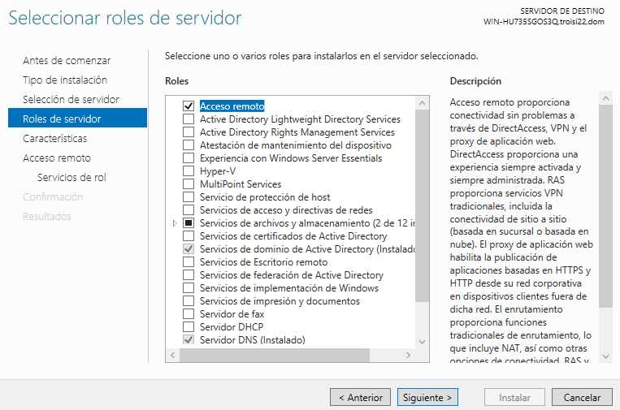
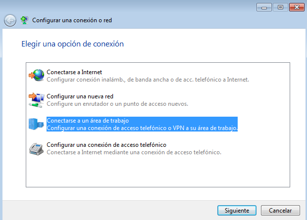
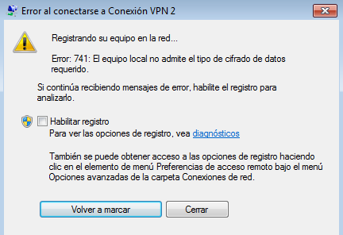

# VPN - WIN SERVER 2016

***Nombre:*** Nahuel Ivan Troisi

 

***Curso:*** 2º de Ciclo Superior de Administración de Sistemas Informáticos en Red.

## ÍNDICE

+ [Introducción](#id1)
+ [Objetivos](#id2)
+ [Material empleado](#id3)
+ [Desarrollo](#id4)
+ [Conclusiones](#id5)

## ***Introducción***. 

Vamos a crear un servicio de conexiones VPN. 

## ***Objetivos***. 

Crear el servicio de conexiones VPN y comprobar que funciona. 

## ***Material empleado***. 

Para la configuración del servicio VPN vamos a utilizar una MV de Windows Server, mientras que para las comprobaciones pertinentes usaremos una MV con Windows 7. 

## ***Desarrollo***. 

En primer lugar, vamos a comprobar que nuestra MV de Windows Server posee una dirección IP adecuada a la red que nos encontramos. 

Posteriormente, vamos a añadir un nuevo rol en el servivor, concretamente el de ***"Acceso Remoto"***.

Del mismo modo, instalamos las características necesarias para que el servicio funcione correctamente. 

Una vez instalado el servicio, debería de quedar de la manera siguiente. 

Posteriormente, vamos a proceder a configurar nuestra VPN. 

Dentro de la misma, seleccionamos la opción ***"Personalizada"***. 

Del mismo modo, elegimos las opciones de ***"Acceso a VPN"***.

Una vez realizada la configuración, debería de quedar de la manera siguiente.

Ahora vamos a pasar a nuestra MV de Windows 7, para proceder a conectarnos a la VPN. 

Y probamos que funciona la conexión, aunque en este caso, nos da error y no conecta. 

## ***Conclusiones***. 

La práctica es sencilla de realizar si seguimos el tutorial del Campus, aunque personalmente no me ha funcionado pese a seguir los mismos pasos. 