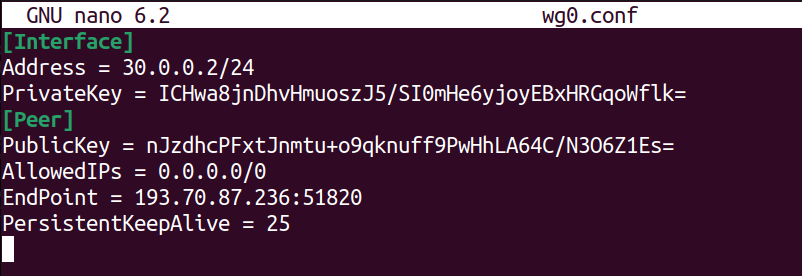
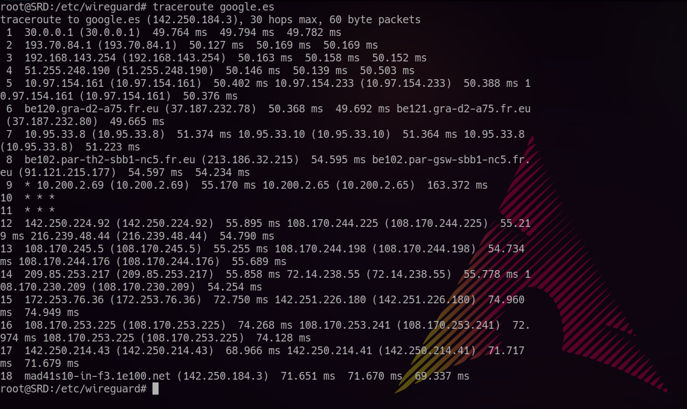

<center>

# VPN - WIREGUARD


</center>

***Nombre:*** Nahuel Ivan Troisi

<br>

***Curso:*** 2º de Ciclo Superior de Administración de Sistemas Informáticos en Red.

## ÍNDICE

+ [Introducción](#id1)
+ [Objetivos](#id2)
+ [Material empleado](#id3)
+ [Desarrollo](#id4)
+ [Conclusiones](#id5)


## ***Introducción***. <a name="id1"></a>

Vamos a crear un servicio de conexiones VPN a través de Wireguard.

## ***Objetivos***. <a name="id2"></a>

Crear el servicio de conexiones VPN y comprobar que funciona. 

## ***Material empleado***. <a name="id3"></a>

Para la configuración del servicio VPN vamos a utilizar un VPS de Ubuntu, mientras que para las comprobaciones pertinentes usaremos una MV con Kali Linux y Arch Linux.

## ***Desarrollo***. <a name="id4"></a>

En primer lugar, vamos a instalar ***Wireguard*** en ambas MV, pero partimos primero de la máquina VPS la cual actuará de servidor. 


Comprobamos que se ha instado correctamente mediante el comando siguiente.  

```
whereis wireguard
```


Y realizamos los mismos pasos en la MV cliente. 


Ahora el próximo paso es crear un par de claves público-privada en el servidor mediante el comando que se muestra a continuación.


Y repetir el mismo proceso en la MV cliente. 


Una vez realizado, vamos a crear un archivo de configuración donde alojar todos los parámetros a tener en cuenta a la hora de crear nuestro servicio VPN, empezando por la configuración del servidor, la cual debería de quedar de la manera siguiente.


Del mismo modo, deberemos de realizar un proceso similar en la MV cliente, quedando tal que así. 



Finalmente, habilitamos el servicio en ambas MV y comprobando que el servicio se encuentra activo tanto en una como en la otra. 


Una vez configurado correctamente el servicio VPN en ambas MV, comprobamos que en ambos casos las llaves público-privadas coinciden, haciendo uso del comando ***wg***. 


Y realizaremos dos comprobaciones. En primer lugar, un ***ssh*** de la MV cliente al servidor mediante la VPN. 


Y por otro lado, una prueba de conectividad mediante ***traceroute*** para comprobar que se conecta correctamente a nuestra VPN.



---

Otra configuración que podemos crear es una conexión VPN a través del móvil mediante un código QR.
Para ello deberemos de instalar ***qrencode***.


E insertamos la siguiente línea de comando en nuestro archivo de configuración anteriormente mencionado, concretamente en la MV cliente. 


Lo que nos genera el siguiente QR.


Una vez realizado este paso, vamos a descargar la aplicación ***Wireguard*** en nuestro móvil y vamos a escanear el QR anterior. 


Activamos dicha conexión VPN. 


Y debería de darnos la IP correspondiente a nuestro servidor VPN. 


## ***Conclusiones***. <a name="id5"></a>

Me parece una práctica muy interesante y útil para el día a día. Si bien es cierto que al principio he tenido fallos de conexión, al final he conseguido dar con la solución.
